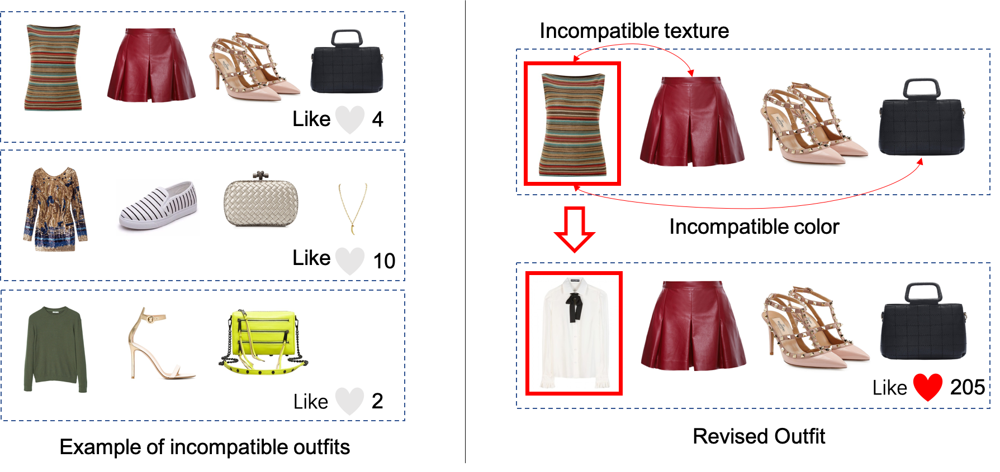
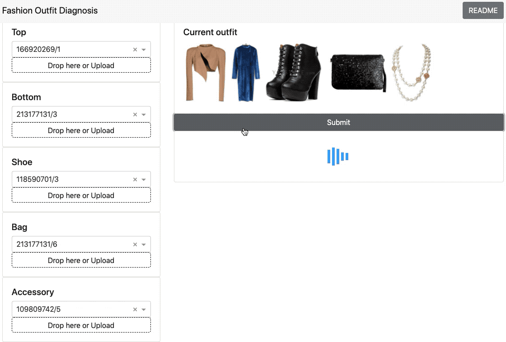

# Outfit Compatibility Prediction and Diagnosis with Multi-Layered Comparison Network


<div align=center>

</div>

<div align=center>

</div>

Paper: 
**Outfit Compatibility Prediction and Diagnosis with Multi-Layered Comparison Network**

by Xin Wang, Bo Wu, Yueqi Zhong. 
Published at ACM MM 2019 in Nice, France.

[[Paper](https://dl.acm.org/doi/10.1145/3343031.3350909)] [[Arxiv](https://arxiv.org/abs/1907.11496)] [[Demo](https://outfit-diagnosis.herokuapp.com)]

## Contents of this repository

* [mcn](./mcn): Main program source code
* [data](./data): **Polyvore-T** datasets based on [Polyvore](https://github.com/xthan/polyvore-dataset).
* [baselines](./baselines): Compared baselines in our experiment
* [exp](./exp): Experiment details, scripts and results etc.

## Requirements

Ubuntu 16.04, NVIDIA GTX 1080Ti (for batch size 16), python >= 3.5.2

```
torch==1.0.1
torchvision==0.2.1
networkx==2.4
opencv-python==4.2.0.32
matplotlib==2.2.2
scikit-learn==0.21.2
```

## Usage

1. Download the original [Polyvore](https://github.com/xthan/polyvore/) dataset, then unzip the file and put the `image` directory into `data` folders (or you can create a soft link for it).

2. Train

   ```sh
   cd mcn
   python train.py
   ```

3. Evaluate

   ```
   python evaluate.py
   ```

4. Visualize outfit diagnosis

   ```
   cd exp
   python diagnosis.py
   ```


5. Automatically revise outfit

   ```
   python revision.py
   ```

## Prediction Performance

Pretrained model weights can be found in the links. The train, validation and test split is provided in [data](./data/).

|                                                              |    AUC    |   FITB    |
| :----------------------------------------------------------- | :-------: | :-------: |
| Pooling                                                      |   88.35   |   57.28   |
| Concatenation                                                |   83.40   |   52.91   |
| Self-attention                                               |   79.65   |   48.60   |
| [BiLSTM](https://drive.google.com/open?id=1WaUP0X-ytZ05HYzeHmdBSzT9gcjF1c46) |   74.82   |   46.02   |
| [CSN](https://drive.google.com/open?id=1EYwtJBRMFxRDzQs7JNYQhp2TpRF2fw9r) |   84.90   |   57.06   |
| [Ours](https://drive.google.com/open?id=1WAErKHDmDfamZQt90wAOC5Db04euIeIP) | **91.90** | **64.35** |

## Demo

A demo application is in the [app](./app) directioy. You can run it locally by go to [app](./app) directory then use command ``python main.py``.

More guide can be found in [here](./app/README.md).

## Cite

Please cite our paper if you use or refer this code:

```
@inproceedings{wang2019diagnosis,
  title={Outfit Compatibility Prediction and Diagnosis with Multi-Layered Comparison Network},
  author={Xin Wang, Bo Wu and Yueqi Zhong},
  booktitle={ACM International Conference on Multimedia},
  year={2019}
}
```
